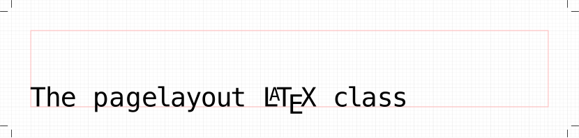
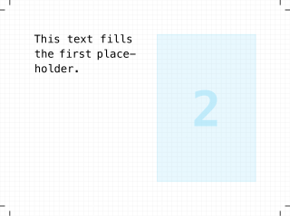
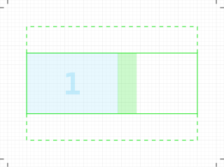
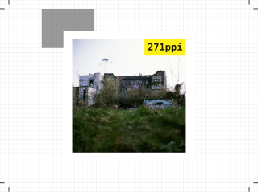

The pagelayout class enables you to design pages declaratively using simple macros for pages, covers, grids, templates, text, and graphics to create graphic rich, perfectly typeset, and print ready PDFs.

The integration of [Inkscape](https://inkscape.org) allows your to create box shadows. Text shadows and SVG filters are ideas for future releases.

The integration of [ImageMagick](https://imagemagick.org) allows you to configure compression and sharpening for bitmap graphics to export web, print or preview versions of your document. Parallelized image optimization, caching, and a draft mode enable fast PDF creation and a responsive workflow, even for large documents with lots of photos and graphics.

The pagelayout class also integrates the [TikZ](https://www.ctan.org/pkg/pgf) and [tcolorbox](https://www.ctan.org/pkg/tcolorbox) LaTeX packages.

## Quick Start

### Pages

Create a page with the `\page` command. A grid with rows and cells helps you to arrange content. Use the `\setgrid` command to define your grid. The following example shows a grid with one row containing two cells.

```latex
\page{
  \setgrid{
    {{}{}}
  }
  \text[breakable]{
    Lorem ipsum dolor sit amet, consectetuer adipiscing elit. Ut purus elit, vestibulum ut, placerat ac, adipiscing vitae, felis. Curabitur dictum gravida mauris. Nam arcu libero, nonummy eget, consectetuer id, vulputate a, magna. Donec vehicula augue eu neque. Pellentesque habitant morbi tristique senectus et netus et malesuada fames ac turpis egestas. Mauris ut leo. Cras viverra metus rhoncus sem. Nulla et lectus vestibulum urna fringilla ultrices. Phasellus eu tellus sit amet tortor gravida placerat.
  }
  \usetext
}
```



### Templates

You can set width relations between grid cells and height relations between grid rows. You can give cells a explicit aspect ratio by adding a `!`. With the `\newtemplate` command you can create reusable layouts.

```latex
\newtemplate{my template}{
  \setgrid{
    {[2]{3!}{2!}}
  }
  \placeholder{0 0 1 1}
  \placeholder{0 1 1 2}
}

\template{my template}{}
```



You can set margin and gutter at grid, page, or document level.

### Graphics

You can scale and position a graphic. And you can add borders and box shadows to graphics and text frames.

```latex
\newborder{my border}{
  width = 1mm,
  color = white,
  radius = 5mm
}
\newshadow{my shadow}{size = 7}

\template{my template}{
  \graphic[
    scale = 1.1,
    vpos = 0.3,
    unsharp = 3x1,
    shadow = my shadow,
    border = my border,
    border radius = 0mm
  ]{kopi}
}
```



Have a look at the [examples](doc) to learn how to create double pages, covers, and more.

For a complete reference, read the [manual](doc/pagelayout-manual.pdf).

## Installation

In general, you should use the package manager shipped with your TeX distribution to install the pagelayout package.

To install manually, copy the contents of [pagelayout.tds.zip](https://github.com/friedemannbartels/latex-pagelayout/releases/download/1.1.0/pagelayout-1.1.0.tds.zip) to your local TeX directory tree and run the command `texhash`.

To enable image optimization, shadow creation, and preflight, perform these installation steps:

- Make sure that ImageMagick 7.0 or later and Inkscape 1.0 or later are installed.

- Find your top level _texmf.cnf_ with the command `kpsewhich texmf.cnf`, and add `pagelayoutapi` to the list of `shell_escape_commands`.
  ```
  shell_escape_commands = pagelayoutapi
  ```
- When installing manually, add the directory _scripts/pagelayout_ to your `PATH`.

## Development

Run visual regression tests inside the _tests_ directory with the command `textestvis`.

## License

Copyright (c) 2022-2023 Friedemann Bartels. Free use of this software is granted under the terms of the LaTeX Project Public License version 1.3c or later.
